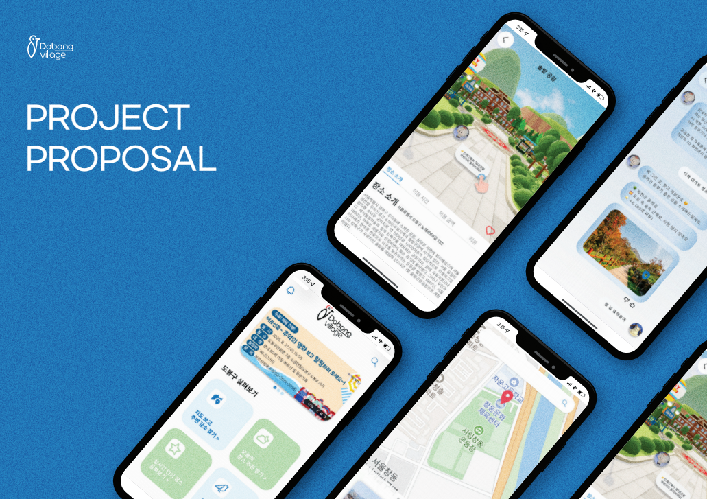
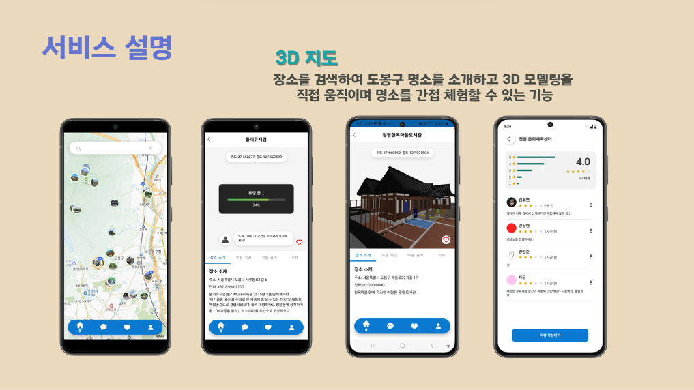
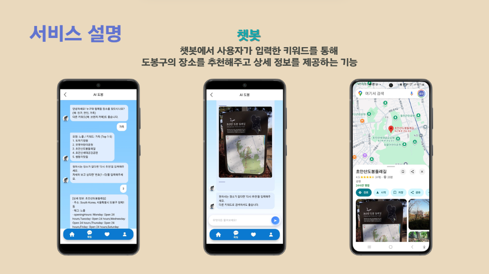
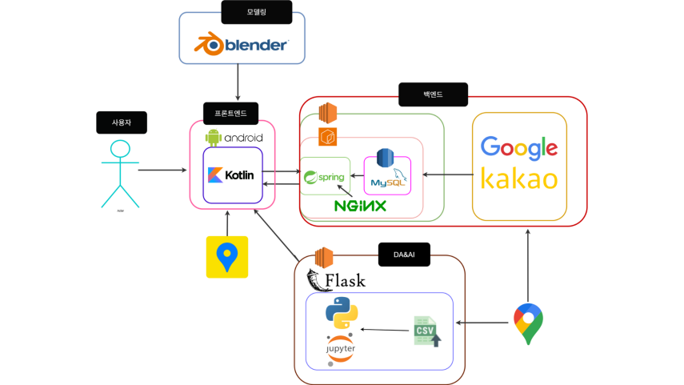

# 🏘️ 도봉 마을 탐험대 (Dobong Village Explorers)


"도봉구의 숨겨진 매력을 3D 인터랙티브 맵으로 탐험하다."

지역 데이터를 시각화하고 사용자 참여를 유도하여 도봉구를 홍보하는 커뮤니티 플랫폼입니다.

---
## 📅 프로젝트 소개





---
## ‍💻 팀원

| FE | FE | BE | DA&AI | MODELING | MODELING |
| :---: | :---: | :---: | :---: | :---: | :---: |
| <br>[@ziizero](https://github.com/ziizero) | <br>[@chubin925](https://github.com/chubin925) | <br>[@hyo-lin](https://github.com/hyo-lin) | <br>[@lyoonji](https://github.com/lyoonji) | <br>[@YEJUNfootcleaner](https://github.com/YEJUNfootcleaner) | <br>[@imperial-girl](https://github.com/imperial-girl) |

---

## 🚀 프로젝트 개요

- **프로젝트명**: 도봉 마을 탐험대 (DobongExplorers)
- **Framework**: Spring Boot 3.5.3
- **빌드 도구**: Gradle
- **Database**: MySQL 8.0.33
- **배포 방식**: EC2

---

## 🏗️ 아키텍쳐



---
## 🧩 주요 기술 스택

| 기술              | 설명 |
|------------------|------|
| Spring Boot      | RESTful 백엔드 프레임워크 |
| Spring Data JPA  | ORM 기반 DB 접근 |
| MySQL            | 명소 및 사용자, 퀘스트 정보 저장 |
| Swagger          | API 명세 자동 문서화 도구 |
| JWT + Security   | 사용자 인증 및 보안 처리 |


---
## 📝 Git Commit Convention
Spring Boot 기반 백엔드 프로젝트를 위한 Git 커밋 메시지 작성 규칙입니다.

---

✅ 커밋 메시지 형식
```angular2html
<type>(<scope>): <subject>
```

>feat(member): 회원가입 API 구현<br>
>fix(auth): 로그인 실패 오류 수정<br>
refactor(schedule): 서비스 레이어 분리

이슈 번호를 포함하면 GitHub에서 자동으로 연결됩니다:

>feat(location): 명소 조회 기능 구현 (#12) <br>
---
## 🧩 Type 목록

| Type       | 설명                   |
| ---------- | -------------------- |
| `feat`     | 새로운 기능 추가            |
| `fix`      | 버그 수정                |
| `refactor` | 리팩토링 (기능 변화 없음)      |
| `style`    | 코드 포맷, 세미콜론, 공백 등 수정 |
| `test`     | 테스트 코드 작성/수정         |
| `docs`     | 문서 관련 수정             |
| `chore`    | 빌드, 설정, CI 관련 작업 등   |


## 🌿 Branch Naming Convention
협업을 위해 브랜치 네이밍을 다음과 같이 통일합니다.

📌 브랜치 이름 형식

```angular2html
<type>/<작업-설명>-<이슈번호>
```
type: feat, fix, refactor 등 커밋 타입과 동일

작업-설명: 케밥케이스 (소문자 + 하이픈)

이슈번호: GitHub 이슈 번호

💡 예시

feat/social-login-4 <br>
fix/jwt-expiration-bug-7 <br>
refactor/member-service-15 <br>

📂 브랜치 종류

| 브랜치 이름       | 용도                 |
| ------------ | ------------------ |
| `main`       | 운영 배포 브랜치          |
| `develop`    | 전체 기능 통합 및 테스트 브랜치 |
| `feat/*`     | 기능 추가 작업 브랜치       |
| `fix/*`      | 버그 수정 브랜치          |
| `refactor/*` | 리팩토링 작업 브랜치        |
| `docs/*`     | 문서 작업 브랜치          |
